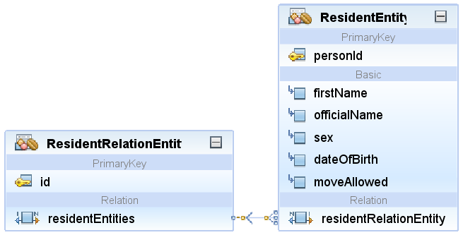

# Personenregister 2018 (personenregister-2018)

> Autoren der Dokumentation: Björn Scheppler

> Dokumentation letztmals aktualisiert: 3.1.2019

Dieses **Maven**-Projekt simuliert das kantonale Personenregister, welches Operationen über **SOAP** bereitstellt.

Dieses Projekt wird in der [**eUmzugPrototyp-Lösung**](https://github.com/zhaw-gpi/eumzug-plattform-2018) verwendet, welche [eumzug.swiss](https://www.eumzug.swiss) nachbildet. Erarbeitet am [**Institut für Wirtschaftsinformatik** an der ZHAW School of Management and Law](http://www.zhaw.ch/iwi) im Rahmen des [Bachelor-Studiengangs Wirtschaftsinformatik](https://www.zhaw.ch/de/sml/studium/bachelor/wirtschaftsinformatik/) im [**Modul Geschäftsprozessintegration**](https://modulmanagement.sml.zhaw.ch/StaticModDescAblage/Modulbeschreibung_w.BA.XX.2GPI-WIN.XX.pdf).

## Komponenten / Funktionalität
1. **Spring Boot**-Applikation mit Tomcat Server, usw.
2. **Persistierung**skomponenten:
    1. **H2**-Datenbank
    2. Einwohner- und Haushalt-**Entitäten** gemäss folgendem Modell:

    3. Einwohner-**JPA-Repository**
    4. data.sql mit initialen Testdaten, die beim Starten der Applikation in die Datenbank eingefügt werden.
3. **SOAP WebService-Komponenten** (PS: mit Apache CXF gelöst statt nur spring-boot-starter-webservices, da letzteres mit der komplexen Struktur des XSD nicht umgehen kann)
    1. SOAP-Webservice-Komponenten (Java API for XML Web Services-Komponenten, CXF-Servlet-Komponenten)
    2. WebServiceConfiguration-Klasse
    3. XML-Schema Definition als Basis für das WSDL und die durch ein Maven-Plugin generierten Klassen (eCH-0194-1-0.xsd)
    5. Schnittstellen-Definition (Endpoint: PersonenRegisterServiceEndpoint)
4. **Geschäftslogik (controller)**: PersonenRegisterController:
    1. Hauptmethode handleDelivery, welche mit der Datenbank kommuniziert und das Ergebnis im Hinblick auf die Webservice-Antwort auswertet
    2. Hilfsmethode populateRelatedPerson, um mitumziehende Personenen für die Webservice-Antwort aufzubereiten
5. **Test-Fälle** als soapUI-Projekt (PersonenRegisterServiceTests-soapui-project.xml)

## Deployment
1. **Erstmalig** oder bei Problemen ein **Clean & Build (Netbeans)**, respektive `mvn clean install` (Cmd) durchführen
2. Bei Änderungen am POM-File oder bei **(Neu)kompilierungsbedarf** genügt ein **Build (Netbeans)**, respektive `mvn install`

## Nutzung
### SOAP-Client allgemein
1. Für den **Start** ist ein **Run (Netbeans)**, respektive `java -jar .\target\NAME DES JAR-FILES.jar` (Cmd) erforderlich. Dabei wird Tomcat gestartet, die Datenbank erstellt/hochgefahren mit den Eigenschaften (application.properties) und die verschiedenen Resourcen-URL-Mappings vorgenommen.
2. Beim Starten werden die **Insert-Statements** in src\main\ressources\data.sql ausgeführt.
3. Über http://localhost:8083/soap prüfen, ob die **WSDL** aufgerufen werden kann.
4. In einem **SOAP-Client** (z.B. soapUI) mit dieser WSDL Requests bauen und aufrufen oder alternativ das bereits in src\test\resources\PersonenRegisterServiceTests-soapui-project.xml vorhandene soapUI-Projekt nutzen.
5. Das **Beenden** geschieht mit **Stop Build/Run (Netbeans)**, respektive **CTRL+C** (Cmd)

### SOAP-Client Umzugsplattform
Hierzu den Anweisungen folgen in https://github.com/zhaw-gpi/eumzug-plattform-2018

### Fortgeschrittene Nutzung (Datenbank-Konsole)
1. Um auf die Datenbankverwaltungs-Umgebung zuzugreifen, http://localhost:TOMCAT_PORT/console eingeben.
2. Anmeldung über:
    1. Benutzername sa
    2. Passwort: leer lassen
    3. URL jdbc:h2:./DATENBANKNAME_GEMAESS_APPLICATION.PROPERTIES

## Prototypische Vereinfachungen
1. In personMoveRequest werden die municipalityId und municipalityName vermutlich deshalb mitgeliefert, weil eine Person in mehreren Gemeinden registriert sein kann (Hauptwohnsitz und Wochenaufenthalter). Das heisst, moveAllowed müsste eigentlich bei der Beziehungstabelle sein zwischen Municipality und Resident. Dies mit JPA umzusetzen, ist gar nicht so einfach, u.a. braucht es dann eine eigene Entität für diese Beziehungstabelle mit einem Pseudo-Primärschlüssel: https://www.thoughts-on-java.org/many-relationships-additional-properties/. Daher lassen wir dies weg.
2. Schema Validation: Mit @SchemaValidation bei der Webservice-Endpoint-Klasse werden lediglich Standard-Fehlermeldungen ausgegeben, nicht aber benutzerdefinierte. Das ist ok bei einem Prototyp. Störender ist, dass XJC keine Annotations für die XSD-Restrictions hinzufügt (also, dass z.B. ein String nicht leer oder länger als 40 Zeichen sein darf). Es gibt teilweise Plugins, aber die sind seit mehreren Jahren nicht mehr aktualisiert => man müsste entweder ein eigenes Plugin schreiben oder aber die Annotations in den generierten Java-Klassen von Hand hinzufügen, aber dann wäre die Generierung im Build-Prozess natürlich nicht mehr opportun.

## Mitwirkende
1. Björn Scheppler: Hauptarbeit
2. Peter Heinrich: Der stille Support im Hintergrund mit vielen Tipps sowie zuständig
für den Haupt-Stack mit SpringBoot & Co.
3. Studierende Bekim Kadrija, Jovica Rajic, Luca Belmonte, Simon Bärtschi, Sven Baumann): Mitzuziehende Personen (HouseholdEntity und Co.)